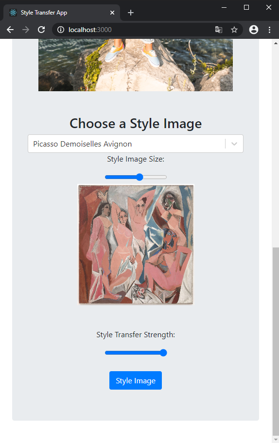

# Style transfer Web App

This repository implements a web application using React and Bootstrap. The app does a image resize and a fast arbitrary style transfer operation using two images. It does all its processing on the front end by the browser. The model used is the [@magenta/image](https://github.com/magenta/magenta-js/tree/master/image). A more detailed explanation of the model can be found on the [Reiichiro Nakano post](https://magenta.tensorflow.org/blog/2018/12/20/style-transfer-js/) about his implementation.

## Folders and Files

The basic struct was created using the build setup offered by React.

    npx react-creat-app

- [/public](./public) : Folder containing the index html.
- [/src](./src): Folder containing the javascrip and css for the index.
    - [App.js](./src/App.js): Main file, containing the aplication component. Here is where the main code is.
- [package.json](./package.json): Project dependecies.

## App Implementation and  Usage

The application does a style transfer using a Content Image to be alter and a Style Image for reference. So, in order to do that, it request an image to the user by an input button. After that, there is a slider to resize the input image.
    
> **Note that** the style transfer model requires a lot of memory, so the biggest dimension size of the image is capped at 600px. It's because the browser might not handle larger images, and even with the limitation it might not work properly on the max size.

After the Content Image is defined and its size is set, there is the need to choose a Style Image. The Style Image can be chosen from a list. After that, the Style Image can also be resized for performance improvement, and the transfer strength can be set. When both images are defined, the user can press a button to perform the style transfer. With the image processing finished, the Output Image will be shown bellow the Style Image button.

## Example Images

